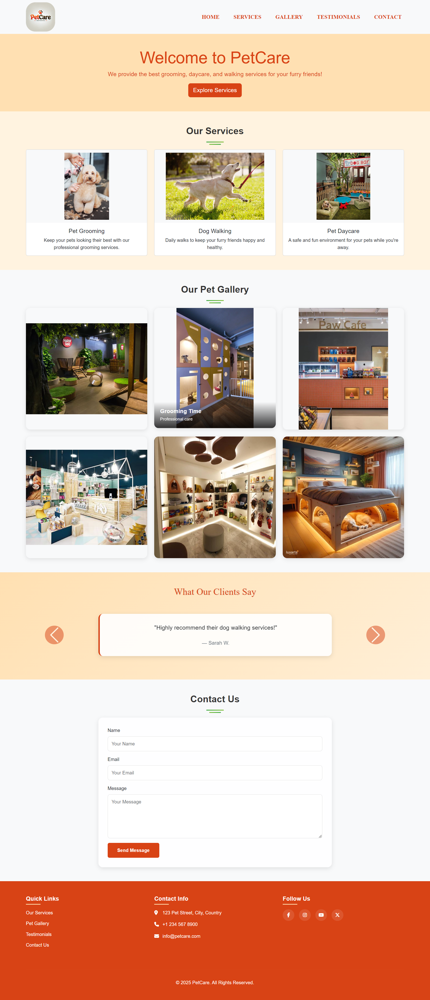

# PetCare Website

A modern and responsive website for a pet care business, featuring services like grooming, dog walking, and daycare.

## Features

### 🎯 Main Sections

1. **Navigation Bar**

   - Responsive navigation with logo
   - Smooth scrolling to sections
   - Mobile-friendly hamburger menu

2. **Hero Section**

   - Welcoming message
   - Call-to-action button
   - Clean and attractive design

3. **Services Section**

   - Pet Grooming
   - Dog Walking
   - Pet Daycare
   - Image cards with descriptions

4. **Gallery Section**

   - Interactive image gallery
   - Hover overlay effects
   - Responsive grid layout

5. **Contact Form**

   - Form validation
   - Success message display
   - User-friendly interface

6. **Footer**
   - Quick navigation links
   - Contact information
   - Social media integration (Facebook, Instagram, YouTube, Twitter)

### 💡 Technical Features

- **Responsive Design**: Works on all devices (mobile, tablet, desktop)
- **Form Validation**: Client-side validation for all form fields
- **Interactive Elements**: Hover effects and smooth transitions
- **Image Optimization**: Proper image sizing and display
- **Modern UI**: Clean and professional design

## 🛠️ Technologies Used

- HTML5
- CSS3
- JavaScript
- Bootstrap 5
- Font Awesome Icons

## screenshot

